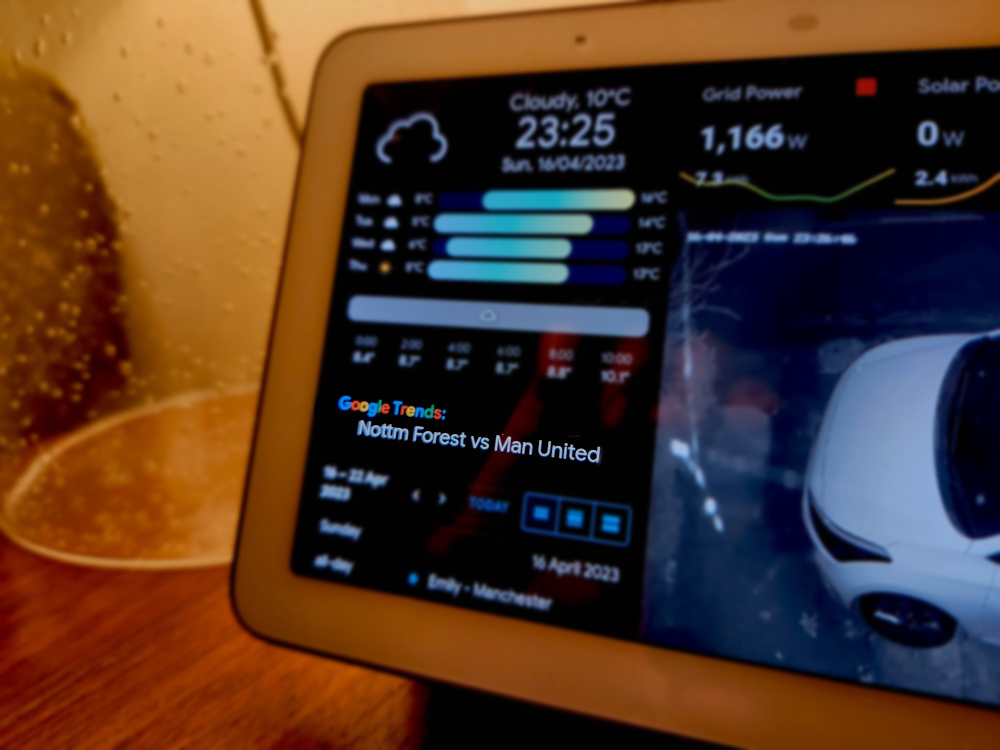

# <center>Google Trends Integration for Home Assistant </center>

<p align="center">
  


This custom integration for Home Assistant retrieves the top Google search trends for a specific country. The entity will update every 10 seconds displaying the next trend.

There is also a custom lovelace card for displaying the entity that you can install by visiting the Github page [here](https://github.com/b0mbays/google-trends-card) after installing the integration.

<p align="center">
  
</p>
<br/><br/>

✨**Features:**
============

- Retrieves the top Google search trends for a specific country
- Custom lovelace card for showing the trends
- Configurable number of trends
- Configurable update interval
- Configurable country code

<br/><br/>

🚀**Installation:**
============

### **HACS:**

1. Go to the HACS panel in Home Assistant.
2. Click on the three dots in the top right corner and choose "Custom repositories".
3. Enter `b0mbays/google-trends` in the "Add custom repository" field, select "Integration" from the "Category" dropdown, and click on the "Add" button.
4. Once the custom repository is added, you can install the integration through HACS. You should see "Google Trends" in the "Integrations" tab. Click on "Download" to add it to your Home Assistant instance.
5. Restart Home Assistant to load the custom integration.
6. Install the integration from the Integrations menu, setting your custom number of trends, update interval and country. (Country examples below)
7. Install the custom google-trends-card from [here](https://github.com/b0mbays/google-trends-card).

<br/><br/>

⚙️**Configuration**
============

### **Country Examples:**

```
United States: united_states
United Kingdom: united_kingdom
Canada: canada
Australia: australia
Germany: germany
France: france
India: india
Brazil: brazil
Japan: japan
Spain: spain
```